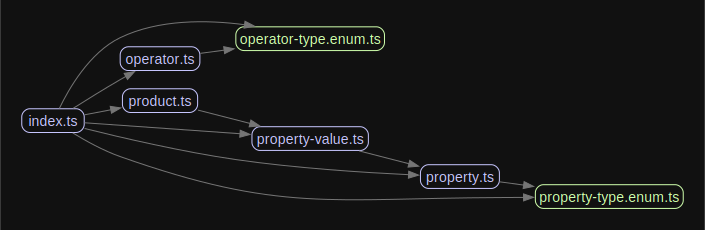

# Condition Editor UI

Welcome to the condition editor workspace! This README provides an overview of the project's structure, key components, insight on the implementation and how to get started.

## Table of Contents

-   [Project Structure](#project-structure)
-   [Key Components](#key-components)
-   [Implementation](#implementation)
-   [Getting Started](#getting-started)
-   [Running Tests](#running-tests)

## Project Structure

The project is organized into several directories and files, each serving a specific purpose:

### Key Directories and Files

-   **src/**: Contains the source code for the project.
    -   **api/**: Contains all API related code useful for fetching data.
        -   **[getOperators](src/api/getOperators.ts)**: For fetching operators for a given property type.
        -   **[getProducts](src/api/getProducts.ts)**: For fetching products for a given condition filter.
        -   **[getProperties](src/api/getProperties.ts)**: For fetching properties.
        -   **[getProperty](src/api/getProperty.ts)**: For fetching a property given an id.
    -   **components/**: Contains reusable React components.
        -   **[AutocompleteControl](src/components/AutocompleteControl/AutocompleteControl.tsx)**: For autocomplete functionality, used when the property is enumerated and the operator is IsAnyOf.
        -   **[SelectFormControl](src/components/SelectFormControl/SelectFormControl.tsx)**: For select form control, used for property and operator selection, as well as, filter selection when the property type enumerated and the operator is not IsAnyOf.
        -   **[TextFieldFormControl](src/components/TextFieldFormControl/TextFieldFormControl.tsx)**: For text field form control, used when the property is not Enumerated.
        -   **[FilterControl](src/components/FilterControl/FilterControl.tsx)**: For filtering products, uses all of the controls mentioned above and decides their proper application.
        -   **[ProductTable](src/components/ProductTable/ProductTable.tsx)**: For displaying a table of products.
    -   **helpers/**: Contains helper functions.
        -   **[isValidOperator](src/helpers/isValidOperator.ts)**: Function to validate operators.
    -   **theme/**: Contains theme definitions.
        -   **[palette](src/theme/palette.ts)**: Contains the color palette used in the app.
        -   **[theme](src/theme/theme.ts)**: Contains the theme definitions, like component customizations.
    -   **types/**: Contains TypeScript type definitions and enums.
        -   **[OperatorType](src/types/operator-type.enum.ts)**: Enum for operator types.
        -   **[Operator](src/types/operator.ts)**: A type that represents an operator.
        -   **[Product](src/types/product.ts)**: A type that represents a product.
        -   **[PropertyType](src/types/property-type.enum.ts)**: Enum for property types.
        -   **[PropertyValue](src/types/property-value.ts)**: A type that represents a property value.
        -   **[Property](src/types/property.ts)**: A type that represents a property.
    -   **[App](src/App.tsx)**: Main application component where most of the components are used.
    -   **[main](src/main.tsx)**: Entry point for the React application.

## Implementation

### Tooling

The implementation was done in [React](https://react.dev/) with Typescript, [MUI](https://mui.com/) for UI components, and [Vite](https://vite.dev/) to build it all. Tests were created using [Vitest](https://vitest.dev/) and [Testing Library](https://testing-library.com/).

### Process

I started my development process by analyzing the wireframe and specification to understand what the UX/UI could be. That led to me choosing [MUI](https://mui.com/) for the UI since it's very feature rich, their API has more than enough sugar to work with and it's very easy to customize - I created a Halloween inspired color palette in no time! \
Afterwards, I wrote the necessary types and their relationships with each other:


_types (graph built with [madge](https://www.npmjs.com/package/madge))_

Once the types were laid down, I wrote down some notes about the UX/UI flows and behaviors (some of them in the form of test cases), and then I started implementing the components and API mentioned above in [Key Directories and Files](#key-directories-and-files):


_components (graph built with [madge](https://www.npmjs.com/package/madge))_

### Time Spent
This challenge took me about 15 to 18 hours to complete. 

## Getting Started

To get started with the project, follow these steps:

1. **Clone the repository**:

    ```sh
    git clone https://github.com/brunomfv/condition-editor-ui.git
    ```

1. **Install dependencies**:

    ```sh
    npm install
    ```

1. **Start the development server**:

    ```sh
    npm start
    ```

1. **Open the application**: Open your browser and navigate to http://localhost:5173

## Running Tests

To run the tests, run
    ```
    npm test
    ```

This will run the tests using Vitest and React Testing Library.
